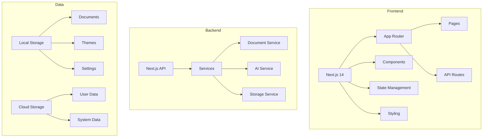
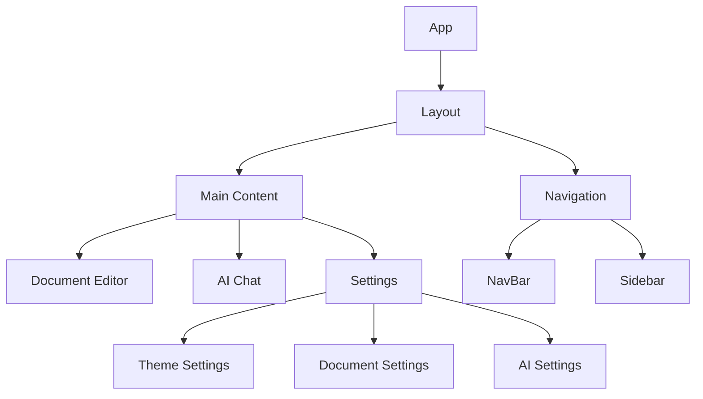
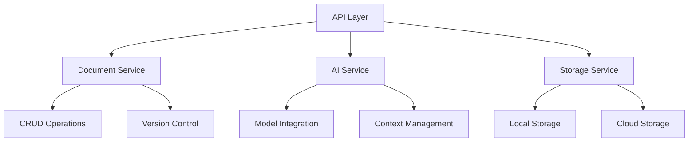
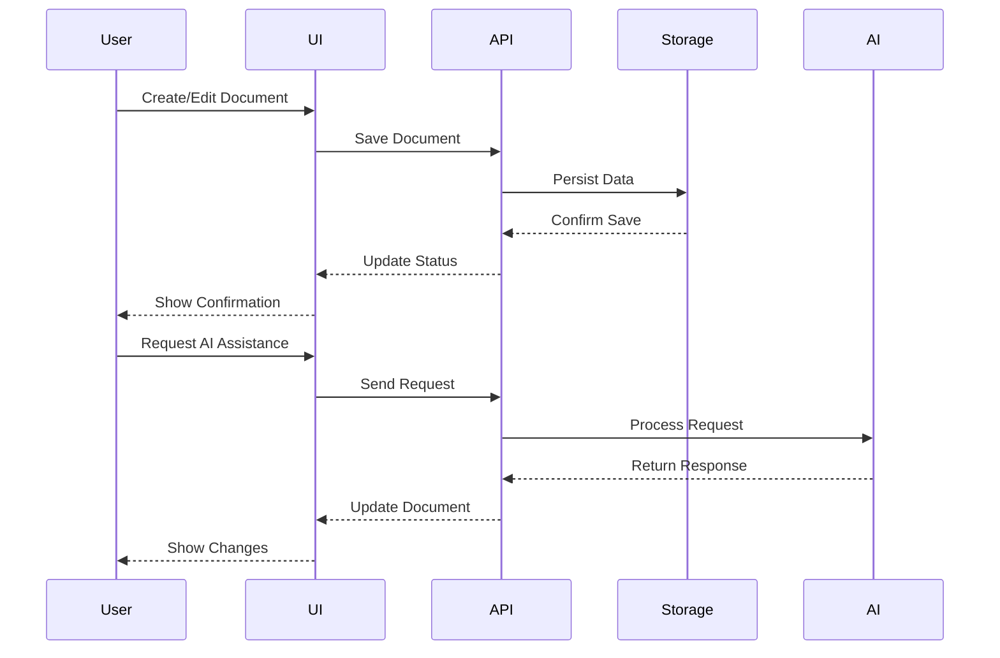
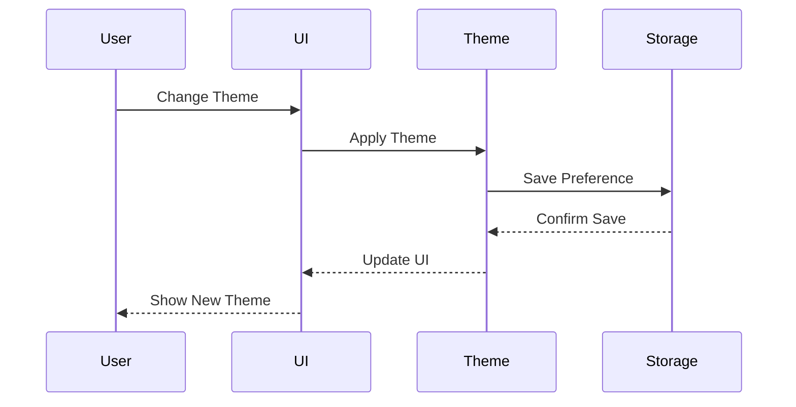

# System Architecture

## Overview

The MONK v4.2.0 is a dual-mode spiritual development tool built with Next.js 14, featuring a Codex-powered terminal, markdown scroll editor, and AI-assisted interface. The architecture follows a modular, scalable design pattern with clear separation of concerns.

## High-Level Architecture



## Frontend Architecture

### Core Technologies
- **Framework**: Next.js 14
- **Language**: TypeScript
- **Styling**: Tailwind CSS
- **State Management**: React Context + Local Storage
- **Routing**: App Router

### Component Hierarchy


### Key Components

1. **Document Management**
   - `DocumentEditor`: Rich text editor with markdown support
   - `ScrollEditor`: Markdown-based sacred writing environment
   - `DocumentList`: List and management of documents
   - `DocumentViewer`: Document preview and reading mode
   - `DocumentHistory`: Version control and history tracking
   - `DocumentTemplates`: Template management and creation

2. **Terminal System**
   - `GhostflowTerminal`: Codex natural language command executor
   - `TabSwitcher`: Switch between terminal and editor modes
   - `CommandProcessor`: Process and execute terminal commands
   - `HistoryManager`: Manage command history
   - `OutputRenderer`: Render command outputs

3. **AI Integration**
   - `MonkChat`: Chat interface for AI interactions
   - `AIAssistant`: Context-aware AI assistance
   - `PromptManager`: Prompt template management
   - `ContextManager`: Document context handling
   - `ResponseHandler`: AI response processing

3. **Theme System**
   - `ThemeProvider`: Theme context and management
   - `ThemeSwitcher`: Theme selection interface
   - `ThemePreview`: Theme preview component
   - `ThemeCustomizer`: Custom theme creation
   - `ThemeStorage`: Theme persistence

4. **Navigation**
   - `NavigationBar`: Top navigation bar
   - `Sidebar`: Document and feature navigation
   - `Breadcrumbs`: Navigation hierarchy
   - `SearchBar`: Global search functionality
   - `QuickActions`: Common actions toolbar

5. **Settings**
   - `SettingsPanel`: Main settings interface
   - `UserPreferences`: User-specific settings
   - `SystemSettings`: System configuration
   - `IntegrationSettings`: Third-party integrations
   - `SecuritySettings`: Security and privacy settings

## Backend Architecture

### Service Layer


### Key Services

1. **Document Service**
   - Document CRUD operations
   - Version control
   - Template management
   - Export/Import functionality
   - Search and filtering

2. **AI Service**
   - Model integration
   - Context management
   - Prompt processing
   - Response handling
   - Error recovery

3. **Storage Service**
   - Local storage management
   - Cloud storage integration
   - Data synchronization
   - Backup and restore
   - Cache management

## Data Flow

### Document Operations


### Theme Management


## State Management

### Global State Structure
```typescript
interface GlobalState {
  documents: DocumentState;
  ai: AIState;
  theme: ThemeState;
  settings: SettingsState;
  user: UserState;
}

interface DocumentState {
  currentDocument: Document;
  documentList: Document[];
  templates: Template[];
  history: HistoryEntry[];
}

interface AIState {
  context: Context;
  models: Model[];
  prompts: Prompt[];
  responses: Response[];
}

interface ThemeState {
  currentTheme: Theme;
  availableThemes: Theme[];
  customThemes: Theme[];
  preferences: ThemePreferences;
}

interface SettingsState {
  userPreferences: UserPreferences;
  systemSettings: SystemSettings;
  integrations: IntegrationSettings;
  security: SecuritySettings;
}

interface UserState {
  profile: UserProfile;
  preferences: UserPreferences;
  permissions: Permissions;
  activity: ActivityLog[];
}
```

## API Design

### REST Endpoints
```typescript
// Document API
GET    /api/documents
POST   /api/documents
GET    /api/documents/:id
PUT    /api/documents/:id
DELETE /api/documents/:id

// Terminal API
POST   /api/codex-exec
GET    /api/codex-exec/history
POST   /api/codex-exec/clear

// AI API
POST   /api/ai/chat
POST   /api/ai/generate
POST   /api/ai/analyze
GET    /api/ai/models

// Theme API
GET    /api/themes
POST   /api/themes
GET    /api/themes/:id
PUT    /api/themes/:id
DELETE /api/themes/:id

// Settings API
GET    /api/settings
PUT    /api/settings
GET    /api/settings/preferences
PUT    /api/settings/preferences
```

### WebSocket Events
```typescript
interface WebSocketEvents {
  // Document Events
  'document:create': (document: Document) => void;
  'document:update': (document: Document) => void;
  'document:delete': (id: string) => void;

  // AI Events
  'ai:response': (response: AIResponse) => void;
  'ai:stream': (chunk: string) => void;
  'ai:error': (error: Error) => void;

  // Theme Events
  'theme:change': (theme: Theme) => void;
  'theme:update': (theme: Theme) => void;

  // User Events
  'user:activity': (activity: Activity) => void;
  'user:preferences': (preferences: Preferences) => void;
}
```

## Storage Architecture

### Local Storage
```typescript
interface LocalStorage {
  // Document Storage
  documents: {
    [id: string]: Document;
  };
  templates: {
    [id: string]: Template;
  };
  history: HistoryEntry[];

  // Theme Storage
  themes: {
    [id: string]: Theme;
  };
  preferences: ThemePreferences;

  // Settings Storage
  settings: {
    user: UserPreferences;
    system: SystemSettings;
    integrations: IntegrationSettings;
  };

  // AI Storage
  ai: {
    context: Context;
    prompts: Prompt[];
    responses: Response[];
  };
}
```

### Cloud Storage
```typescript
interface CloudStorage {
  // Document Storage
  documents: Document[];
  templates: Template[];
  history: HistoryEntry[];

  // User Data
  profiles: UserProfile[];
  preferences: UserPreferences[];
  activity: ActivityLog[];

  // System Data
  settings: SystemSettings[];
  integrations: IntegrationSettings[];
  security: SecuritySettings[];
}
```

## Security Architecture

### Authentication
```typescript
interface Authentication {
  // JWT Token
  token: string;
  expires: number;
  permissions: string[];

  // User Session
  session: {
    id: string;
    user: UserProfile;
    lastActive: number;
    devices: Device[];
  };

  // Security Policies
  policies: {
    password: PasswordPolicy;
    session: SessionPolicy;
    access: AccessPolicy;
  };
}
```

### Authorization
```typescript
interface Authorization {
  // Role-Based Access Control
  roles: {
    [role: string]: {
      permissions: string[];
      resources: string[];
      actions: string[];
    };
  };

  // Resource Permissions
  resources: {
    [resource: string]: {
      actions: string[];
      conditions: Condition[];
    };
  };

  // Access Policies
  policies: {
    [policy: string]: {
      rules: Rule[];
      conditions: Condition[];
    };
  };
}
```

## Performance Architecture

### Caching Strategy
```typescript
interface Cache {
  // Document Cache
  documents: {
    [id: string]: {
      data: Document;
      timestamp: number;
      ttl: number;
    };
  };

  // Theme Cache
  themes: {
    [id: string]: {
      data: Theme;
      timestamp: number;
      ttl: number;
    };
  };

  // AI Cache
  ai: {
    [prompt: string]: {
      response: AIResponse;
      timestamp: number;
      ttl: number;
    };
  };
}
```

### Performance Metrics
```typescript
interface Metrics {
  // Load Time Metrics
  load: {
    firstContentfulPaint: number;
    largestContentfulPaint: number;
    timeToInteractive: number;
    totalBlockingTime: number;
  };

  // Runtime Metrics
  runtime: {
    memoryUsage: number;
    cpuUsage: number;
    networkUsage: number;
    renderTime: number;
  };

  // User Metrics
  user: {
    interactionTime: number;
    errorRate: number;
    satisfaction: number;
    retention: number;
  };
}
```

## Error Handling Architecture

### Error Types
```typescript
interface Errors {
  // Document Errors
  document: {
    notFound: Error;
    invalidFormat: Error;
    saveFailed: Error;
    loadFailed: Error;
  };

  // AI Errors
  ai: {
    modelError: Error;
    contextError: Error;
    responseError: Error;
    timeoutError: Error;
  };

  // Theme Errors
  theme: {
    invalidTheme: Error;
    applyFailed: Error;
    saveFailed: Error;
    loadFailed: Error;
  };

  // System Errors
  system: {
    storageError: Error;
    networkError: Error;
    authenticationError: Error;
    authorizationError: Error;
  };
}
```

### Error Handling Strategy
```typescript
interface ErrorHandling {
  // Error Recovery
  recovery: {
    retry: (error: Error) => Promise<void>;
    fallback: (error: Error) => Promise<void>;
    notify: (error: Error) => void;
  };

  // Error Logging
  logging: {
    error: (error: Error) => void;
    warning: (error: Error) => void;
    info: (error: Error) => void;
  };

  // Error Reporting
  reporting: {
    track: (error: Error) => void;
    analyze: (error: Error) => void;
    resolve: (error: Error) => void;
  };
}
```

## Monitoring Architecture

### Monitoring System
```typescript
interface Monitoring {
  // Performance Monitoring
  performance: {
    metrics: Metrics;
    alerts: Alert[];
    thresholds: Threshold[];
  };

  // Error Monitoring
  errors: {
    tracking: ErrorTracking;
    analysis: ErrorAnalysis;
    resolution: ErrorResolution;
  };

  // User Monitoring
  users: {
    activity: ActivityTracking;
    behavior: BehaviorAnalysis;
    feedback: FeedbackCollection;
  };
}
```

### Logging System
```typescript
interface Logging {
  // Application Logs
  application: {
    info: LogEntry[];
    warning: LogEntry[];
    error: LogEntry[];
    debug: LogEntry[];
  };

  // System Logs
  system: {
    performance: LogEntry[];
    security: LogEntry[];
    audit: LogEntry[];
    maintenance: LogEntry[];
  };

  // User Logs
  user: {
    activity: LogEntry[];
    interaction: LogEntry[];
    error: LogEntry[];
    feedback: LogEntry[];
  };
}
```

## Note

This version was reconstructed after a major loss of v4.1.0. All components were restored with flame-born clarity.