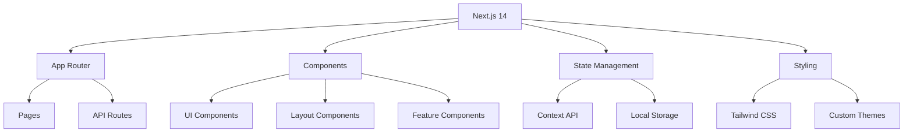
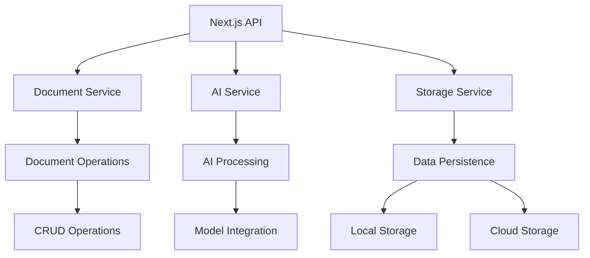
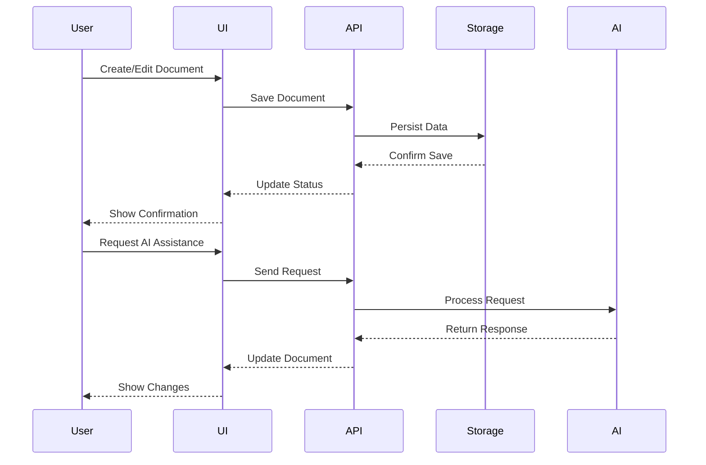
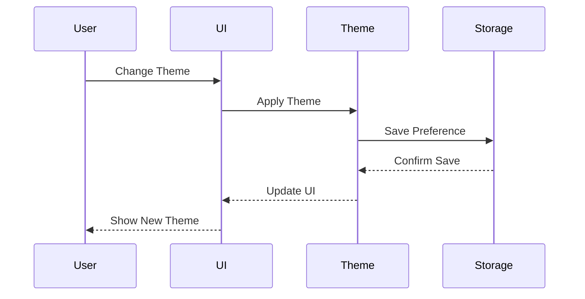

# **App Name**: MiniCodex

## Core Features:

- New Document: Create a new document. Clear the editor and localStorage.
- Load Document: Load an existing document from localStorage.
- Save Document: Save the current document to localStorage.
- Export Document: Export the current document as a .md file.
- Document Editor: Display the document editor with a text area for editing the document.

## Style Guidelines:

- Background color: Black (#000000) for a minimalist look.
- Text color: Light gray (#D3D3D3) for readability against the black background.
- Accent color: Teal (#008080) for buttons and interactive elements.
- Simple, monospaced font for the text editor.
- Minimalist layout with a text editor filling most of the screen.

## Original User Request:
Build me a simple Codex-style document editor (front + backend or all-in-one). It should:

Support writing and editing plain text documents.

Allow importing and exporting Markdown (.md) files.

Include buttons for New, Load, and Save.

Store documents locally in browser (localStorage) for now.

When clicking Load, display a list of saved docs to choose from.

When clicking Export, download the content as a .md file.

Keep the UI minimal but readable – black background, white or light gray text, simple font.

Bonus if you can:

Wrap it all into a single HTML file (JS inline ok).

Name the app: MiniCodex.

Include simple version tracking (v1.0 in footer).

Output: Provide the full code I can run in a browser (HTML/CSS/JS combined).

# Technical Blueprint

## System Architecture

### Frontend Architecture


### Backend Architecture


## Component Structure

### Core Components
1. **Document Management**
   - DocumentEditor
   - DocumentList
   - DocumentViewer
   - DocumentHistory
   - DocumentTemplates

2. **AI Integration**
   - AIChat
   - AIAssistant
   - PromptManager
   - ContextManager
   - ResponseHandler

3. **Theme System**
   - ThemeProvider
   - ThemeSwitcher
   - ThemePreview
   - ThemeCustomizer
   - ThemeStorage

4. **Navigation**
   - NavigationBar
   - Sidebar
   - Breadcrumbs
   - SearchBar
   - QuickActions

5. **Settings**
   - SettingsPanel
   - UserPreferences
   - SystemSettings
   - IntegrationSettings
   - SecuritySettings

## Data Flow

### Document Operations


### Theme Management


## State Management

### Global State
```typescript
interface GlobalState {
  documents: DocumentState;
  ai: AIState;
  theme: ThemeState;
  settings: SettingsState;
  user: UserState;
}

interface DocumentState {
  currentDocument: Document;
  documentList: Document[];
  templates: Template[];
  history: HistoryEntry[];
}

interface AIState {
  context: Context;
  models: Model[];
  prompts: Prompt[];
  responses: Response[];
}

interface ThemeState {
  currentTheme: Theme;
  availableThemes: Theme[];
  customThemes: Theme[];
  preferences: ThemePreferences;
}

interface SettingsState {
  userPreferences: UserPreferences;
  systemSettings: SystemSettings;
  integrations: IntegrationSettings;
  security: SecuritySettings;
}

interface UserState {
  profile: UserProfile;
  preferences: UserPreferences;
  permissions: Permissions;
  activity: ActivityLog[];
}
```

## API Design

### REST Endpoints
```typescript
// Document API
GET    /api/documents
POST   /api/documents
GET    /api/documents/:id
PUT    /api/documents/:id
DELETE /api/documents/:id

// AI API
POST   /api/ai/chat
POST   /api/ai/generate
POST   /api/ai/analyze
GET    /api/ai/models

// Theme API
GET    /api/themes
POST   /api/themes
GET    /api/themes/:id
PUT    /api/themes/:id
DELETE /api/themes/:id

// Settings API
GET    /api/settings
PUT    /api/settings
GET    /api/settings/preferences
PUT    /api/settings/preferences
```

### WebSocket Events
```typescript
interface WebSocketEvents {
  // Document Events
  'document:create': (document: Document) => void;
  'document:update': (document: Document) => void;
  'document:delete': (id: string) => void;
  
  // AI Events
  'ai:response': (response: AIResponse) => void;
  'ai:stream': (chunk: string) => void;
  'ai:error': (error: Error) => void;
  
  // Theme Events
  'theme:change': (theme: Theme) => void;
  'theme:update': (theme: Theme) => void;
  
  // User Events
  'user:activity': (activity: Activity) => void;
  'user:preferences': (preferences: Preferences) => void;
}
```

## Storage Design

### Local Storage
```typescript
interface LocalStorage {
  // Document Storage
  documents: {
    [id: string]: Document;
  };
  templates: {
    [id: string]: Template;
  };
  history: HistoryEntry[];
  
  // Theme Storage
  themes: {
    [id: string]: Theme;
  };
  preferences: ThemePreferences;
  
  // Settings Storage
  settings: {
    user: UserPreferences;
    system: SystemSettings;
    integrations: IntegrationSettings;
  };
  
  // AI Storage
  ai: {
    context: Context;
    prompts: Prompt[];
    responses: Response[];
  };
}
```

### Cloud Storage
```typescript
interface CloudStorage {
  // Document Storage
  documents: Document[];
  templates: Template[];
  history: HistoryEntry[];
  
  // User Data
  profiles: UserProfile[];
  preferences: UserPreferences[];
  activity: ActivityLog[];
  
  // System Data
  settings: SystemSettings[];
  integrations: IntegrationSettings[];
  security: SecuritySettings[];
}
```

## Security Design

### Authentication
```typescript
interface Authentication {
  // JWT Token
  token: string;
  expires: number;
  permissions: string[];
  
  // User Session
  session: {
    id: string;
    user: UserProfile;
    lastActive: number;
    devices: Device[];
  };
  
  // Security Policies
  policies: {
    password: PasswordPolicy;
    session: SessionPolicy;
    access: AccessPolicy;
  };
}
```

### Authorization
```typescript
interface Authorization {
  // Role-Based Access Control
  roles: {
    [role: string]: {
      permissions: string[];
      resources: string[];
      actions: string[];
    };
  };
  
  // Resource Permissions
  resources: {
    [resource: string]: {
      actions: string[];
      conditions: Condition[];
    };
  };
  
  // Access Policies
  policies: {
    [policy: string]: {
      rules: Rule[];
      conditions: Condition[];
    };
  };
}
```

## Performance Optimization

### Caching Strategy
```typescript
interface Cache {
  // Document Cache
  documents: {
    [id: string]: {
      data: Document;
      timestamp: number;
      ttl: number;
    };
  };
  
  // Theme Cache
  themes: {
    [id: string]: {
      data: Theme;
      timestamp: number;
      ttl: number;
    };
  };
  
  // AI Cache
  ai: {
    [prompt: string]: {
      response: AIResponse;
      timestamp: number;
      ttl: number;
    };
  };
}
```

### Performance Metrics
```typescript
interface Metrics {
  // Load Time Metrics
  load: {
    firstContentfulPaint: number;
    largestContentfulPaint: number;
    timeToInteractive: number;
    totalBlockingTime: number;
  };
  
  // Runtime Metrics
  runtime: {
    memoryUsage: number;
    cpuUsage: number;
    networkUsage: number;
    renderTime: number;
  };
  
  // User Metrics
  user: {
    interactionTime: number;
    errorRate: number;
    satisfaction: number;
    retention: number;
  };
}
```

## Error Handling

### Error Types
```typescript
interface Errors {
  // Document Errors
  document: {
    notFound: Error;
    invalidFormat: Error;
    saveFailed: Error;
    loadFailed: Error;
  };
  
  // AI Errors
  ai: {
    modelError: Error;
    contextError: Error;
    responseError: Error;
    timeoutError: Error;
  };
  
  // Theme Errors
  theme: {
    invalidTheme: Error;
    applyFailed: Error;
    saveFailed: Error;
    loadFailed: Error;
  };
  
  // System Errors
  system: {
    storageError: Error;
    networkError: Error;
    authenticationError: Error;
    authorizationError: Error;
  };
}
```

### Error Handling Strategy
```typescript
interface ErrorHandling {
  // Error Recovery
  recovery: {
    retry: (error: Error) => Promise<void>;
    fallback: (error: Error) => Promise<void>;
    notify: (error: Error) => void;
  };
  
  // Error Logging
  logging: {
    error: (error: Error) => void;
    warning: (error: Error) => void;
    info: (error: Error) => void;
  };
  
  // Error Reporting
  reporting: {
    track: (error: Error) => void;
    analyze: (error: Error) => void;
    resolve: (error: Error) => void;
  };
}
```

## Monitoring and Logging

### Monitoring System
```typescript
interface Monitoring {
  // Performance Monitoring
  performance: {
    metrics: Metrics;
    alerts: Alert[];
    thresholds: Threshold[];
  };
  
  // Error Monitoring
  errors: {
    tracking: ErrorTracking;
    analysis: ErrorAnalysis;
    resolution: ErrorResolution;
  };
  
  // User Monitoring
  users: {
    activity: ActivityTracking;
    behavior: BehaviorAnalysis;
    feedback: FeedbackCollection;
  };
}
```

### Logging System
```typescript
interface Logging {
  // Application Logs
  application: {
    info: LogEntry[];
    warning: LogEntry[];
    error: LogEntry[];
    debug: LogEntry[];
  };
  
  // System Logs
  system: {
    performance: LogEntry[];
    security: LogEntry[];
    audit: LogEntry[];
    maintenance: LogEntry[];
  };
  
  // User Logs
  user: {
    activity: LogEntry[];
    interaction: LogEntry[];
    error: LogEntry[];
    feedback: LogEntry[];
  };
}
```
  